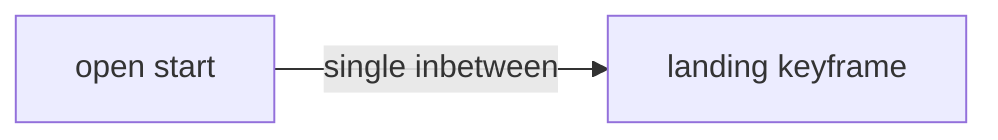

# THM prompt writing guide

How to write **layout** (keyframe) and **inbetween** (video) prompts for the-machine-ui. Use with [SKILL.md](SKILL.md) for project structure, JSON, and builder API.

Full system reference: [docs/prompt_design.md](../../../docs/prompt_design.md)

---

## What you write vs what assets provide

The app **composes** final prompts from layers. You typically write **layout**, **inbetween**, short **setting_prompt** variations, and **asset** descriptions when creating characters/settings/styles.

### Keyframe (still image) assembly

```
project.style_prompt
+ sequence.style_asset
+ sequence.style_prompt
+ sequence.setting_asset
+ sequence.setting_prompt
+ keyframe.layout          ← YOU WRITE (position/framing)
+ character.prompt         ← asset (appearance)
```

### Video (in-between) assembly

```
sequence.action_prompt     ← only when 2+ videos in sequence (consistency, not narrative)
+ video.inbetween_prompt   ← YOU WRITE (motion/event)
+ sequence.setting_asset
+ sequence.setting_prompt
+ sequence.style_asset
+ sequence.style_prompt
+ project.style_prompt
```

Videos do **not** include character or layout text — motion is anchored by start/end keyframes.

### Dual asset prompts (keyframe vs generator)

Each character / location / style asset may store **two prompt layers**:

| Field | Used by |
|-------|---------|
| `prompt` | Keyframe composition (`[char.prompt]`, setting/style asset layers) |
| `generator_prompt` | Assets tab **Generate** only (LoRA iteration, pose anchors) |
| `negative_prompt` | Keyframe negatives |
| `generator_negative_prompt` | Assets tab **Generate** only |

If `generator_*` is empty, Assets Generate falls back to the keyframe field. Keep keyframe `prompt` clean for Klein/reuse; put SDXL churn in `generator_prompt`.

### Your job in one sentence

**Assets** (character / setting / style / global style): rich, modular, scope-pure visual description — see §3.  
**Layout:** physical position and framing only — **explicit frozen anatomy**, not pose shorthand; not character/setting prose from assets. **Custom family:** use `descriptor imageN` in **layout only** (see *Custom family* section).  
**Inbetween:** motion, transformation, camera — not frozen pose. **Custom family:** use **descriptor names only** — no `imageN` (videos do not get reference prelude).

**Composition rule:** layers stack at generation time. Keep each field **self-contained** so any sequence can reuse the same assets without contradiction.

### Standalone text — every field, every row

Each prompt string must **stand alone**. At generation time the app stacks layers for one beat; it does **not** pass memory of other shots, other sequences, or earlier table rows into the model.

**Applies to:** asset prompts, `keyframe.layout`, `video.inbetween_prompt`, `sequence.setting_prompt`, `sequence.action_prompt`, and **every prompt cell in the storyboard table** before JSON exists.

**Never write in prompt text:**

- References to other shots or beats: "as before", "same as shot 1", "continues from previous", "next we see"  
- Deictic carryover: "that product", "the same aisle", "still holding it", "returns there"  
- Ordinal narrative glue: "then", "after that", "finally" (fine in chat with the user — **not** inside prompt fields)  
- Shot/seq numbers or meta: "shot 3 layout", "see above", "from the earlier prompt"  

**Instead:** name the subject, object, place, and visible state **in this field** so the stacked prompt is complete on its own.

| Bad (assumes prior row) | Good (self-contained) |
|-------------------------|------------------------|
| picks up the same cereal as before | shopper picks up red cereal box from middle shelf, label facing out |
| still at checkout | close-up at checkout conveyor, shopper hands on belt, items on scanner |
| walks back down the aisle | shopper walks between stocked aisles toward refrigerated wall |
| as in the establishing shot | wide shot of store exterior at dusk, automatic doors, lit interior visible |

**Storyboard phase:** rows may be ordered for human review, but **KF layout**, **Video motion**, and **setting_prompt** columns must each read as complete prompt text — not shorthand for "you know what I mean from row 2." Narrative arc belongs in chat or a separate notes column, not inside prompt cells.

---

## LoRA placement by role

LoRAs solve different problems on different layers — place by **role**, not convenience.

| Layer | LoRA role | When to use |
|-------|-----------|-------------|
| **Style asset** | Global look, motion bias, grade, lens character | Affects the whole beat's aesthetic and can bias how subjects move |
| **Video clip** (`inbetween_prompt` context) | Localized effects — impacts, destruction, material response, one-moment events | **One clip** in a chain where the effect happens |
| **Character / setting asset** | Identity, environment-specific detail | Subject or place definition |

**Rules:**

- **Effect LoRAs** belong on the **video** where the effect occurs — typically one inbetween in a chain — not duplicated on every clip and not on style if the goal is a single moment  
- **Style LoRAs** on the style asset affect global look and motion bias — do not also stuff the same semantic into every `inbetween_prompt`  
- **Never mirror effect:** if a style LoRA biases subject movement (e.g. gait), do not also describe crowd motion vaguely — crowds will mirror. Style and effect LoRAs are separate; duplicating the same semantic on both layers causes double-strength artifacts  
- **Inbetween prompts describe motion in words** — they are not a second home for style-layer LoRAs  

**Worked example (action / sprint projects):**

| LoRA | Layer | Strength | Do not also put on… |
|------|-------|----------|---------------------|
| Movement / gait bias (e.g. `dinocity-dinomovement`) | Style asset | 1.0 | Any `inbetween_prompt` |
| Impact / debris (e.g. `dinocity-crash`) | **One** crash video clip | 0.75–1.0 | Style asset or every clip in chain |

If movement LoRA is on the style asset, **do not** repeat sprint-gait language as a second LoRA token in video prompts — describe motion in words only on the clips that need it.

---

## 1. Layout prompts (`keyframe.layout`)

Keyframes are **frozen moments**. Still-image generation gives **maximum fidelity** — put hero detail here (close-ups, product-to-camera, readable labels, hands).

### Core rule: position, not intent

Describe what a single frame **shows**, not what the subject **means to do**.

**Good:**

```
medium shot of person seated in chair, hands gripping armrests, body tensed forward

wide shot of person standing before shelf, arm extended holding product, label facing camera

close up on face, optical lens bright, product held near lens

low angle, person left leg lifted off ground reaching forward, right foot planted bearing weight, torso pitched forward, arms at sides, slight motion blur on forward leg, ceiling visible
```

**Bad:**

```
person preparing to stand up              ← intent, not position
person walking toward the checkout        ← action, not frozen pose
person deciding what to buy               ← internal state
the subject looking happy                 ← emotion/impression
person mid-stride                         ← assumed pose label, not visible anatomy
```

### Explicit anatomy, not pose labels

**Both model families.** Layout must spell out **what the body looks like in the still** — limb placement, weight bearing, contact points, head angle. Do not rely on shorthand the model is expected to know: `mid-stride`, `running`, `walking`, `crouching down`, `reaching`, `in motion`.

| Bad (label / assumed knowledge) | Good (frozen, visible anatomy) |
|---------------------------------|--------------------------------|
| mid-stride | left leg lifted off ground reaching forward, right foot planted bearing weight, torso pitched forward, slight motion blur on limbs |
| running | both feet off ground, knees bent, arms pumping opposite to legs, torso leaning forward |
| reaching for shelf | right arm extended upward, fingers spread toward box on shelf, shoulder raised, weight on left leg |
| seated | hips on chair seat, knees bent ninety degrees, feet flat on floor, back against chair back |

If a reader cannot sketch the pose from your text alone, add detail until they can.

### Structure

```
[frame direction] + [subject] + [explicit body position] + [key details]
```

**Frame directions:** wide shot, ultra wide, medium shot, close up, extreme close up, low angle, high angle, side view, from behind, frame left, frame right

**Position language:** use **concrete limb and contact detail**, not category labels alone — which leg bears weight, which is lifted, joint angles, hand state, head facing, torso pitch. Labels like standing, seated, kneeling are fine as **anchors** when followed by specifics: `seated, hips on bench, feet flat, elbows on knees`.

**Key details (sparingly):** props in hand, debris, dust, specific readable label, expression as **visible physical state** (smiling, eyes wide) not abstract mood

### Action poses are valid

Describe a **frozen** moment of action — not the verb over time, and not a one-word pose name:

```
✓ person at counter, hands placing item on belt, fingers spread on package, wrists above conveyor surface
✗ person placing items on the conveyor

✓ medium shot, left leg lifted forward knee bent, right leg straight weight on ball of foot, left arm swung back, right arm forward
✗ medium shot mid-stride, left leg forward
✗ person walking down the aisle
```

Motion blur in the still is fine. The pose can be dynamic; the wording must be a **single capture** with enough anatomy to render without guesswork.

### Fidelity weighting

| Must be keyframe (high fidelity) | Can stay in inbetween only |
|----------------------------------|----------------------------|
| Face close-up, expression | Ambient drift, walking pace |
| Product at camera, readable label | Background pass-by |
| Hands on object (detail matters) | Empty room pan |
| Hero pose, logo, on-screen text | Wide establishing with no critical detail |

**Wrong:** wide KF + inbetween *dollies into product close-up*  
**Right:** close-up product KF + `open_start` inbetween *walks aisle until pick-up*  
**Or:** wide KF + close KF (`layout_end`) + inbetween dolly between them (both closed)

Ask per beat: *"What is the highest-fidelity frame?"* — that is the keyframe.

---

## 2. Inbetween prompts (`video.inbetween_prompt`)

Describe what happens **during** the clip: motion, transformation, events, camera.

### Core rule: motion and change

**Good:**

```
person pushes up from chair, stands, background monitors flicker

hand wipes across dusty shelf surface, revealing product beneath

person walks down aisle, reaches forward, picks up product from shelf

camera drifts slowly across store entrance, automatic doors slide open

time lapse of light shifting across products on shelf
```

### Principles

1. **Self-contained subject** — name the person/product; no "it", "the original", or "that [noun]" pointing at another shot  
   ```
   ✓ the shopper walks forward
   ✗ it walks forward
   ✓ shopper picks up red cereal box from shelf
   ✗ picks up the same product as before
   ```

2. **Match complexity to duration** (whole seconds **1–10** only in THM UI)
   | Duration | Inbetween scope |
   |----------|-----------------|
   | 1–2s | Single action, minimal |
   | 3–4s | Full action with detail |
   | 5–6s | Sequence or transformation |
   | 7–10s | Multiple beats or slow journey |

3. **Dynamic effects belong here** — sparks, lightning, flames, collapse, time lapse, status lights changing

4. **Camera movement** — tracking alongside, pulls back to reveal, looking down from above

5. **Do not push into uncached detail** — if the clip ends on a close-up product label, that close-up must exist as a **keyframe**, not only in the inbetween text

6. **Explicit end-state anchoring** — any inbetween whose motion needs to land in a specific pose by clip-end (fall, jump, spin, sit-down, arrival) should name that **end pose** explicitly, not just the action that starts it. Currently modeled narrowly for crash/vault beats in §5's "Obstacle and crash choreography" (*"KF: subject frozen in air over obstacle below"*, *"no setup trot"*) — that subsection is a worked instance of this general rule, not the only place it applies.

7. **Explicit direction beyond sprints** — unless you state a direction relative to established momentum/orientation, the model will invent one and may contradict the motion that came before it. §5's "Direction, camera, and anti-backward motion" subsection is the **sprint-specific case** of this general rule (lane choreography, forward-only tracking) — any inbetween with significant directional motion (falls, spins, throws, turns), not only races, needs the same explicit-direction treatment.

8. **Rotational/acrobatic motion is high-risk for characters** — prefer single-axis falls or motion (forward stumble, straight backward fall) over compound rotations (flips, spins, inversions) unless there's evidence this pipeline handles rotation well. Confirmed failure mode on a full-body flip/inversion: anatomical distortion during the high-motion middle frames, a fall direction inconsistent with established momentum, and a clip still airborne at 96% through its duration instead of resolving to a landed end-state. When rotation is necessary, apply **principle 6 and principle 7 together** — explicit end-state *and* explicit direction — not either alone.

### `sequence.action_prompt` (multi-clip only)

Leave **empty** when the sequence has **one video** (typical cut).

Use only when **2+ videos** in the same sequence need shared **consistency** (not shot narrative):

- `2 beats per second dance`
- `driving 10 foot per second dolly shot`

Per-shot story stays in each `video.inbetween_prompt`.

---

## Custom family — imageN in keyframe layout only

When `image_model_family` is **`custom`** (reference-image workflows), **`keyframe.layout`** (and paired end-keyframe layout / `layout_end`) must **bind each subject to a reference slot** with **`descriptor imageN`**. The Default SDXL / LoRA / pose setup does not need this — character assets and pose carry identity there.

**Videos never use `imageN`.** Even in Custom family, `video.inbetween_prompt` and `inbetween_prompt_out` are composed **without** reference prelude, character text, or layout. Motion is anchored by the start/end keyframes (which carry the refs). Write inbetweens with **consistent descriptor names** (`green dino`, `blue t-rex`) — not `image1` / `image2`.

### How generation assembles Custom keyframe prompts

THM prepends a **reference prelude** to **keyframe** prompts only (you do not write this):

```
image1 is a character reference.
image2 is a character reference.
image3 is the setting and location reference.
```

Ribbon thumbnails above the keyframe **Prompt** field are labeled **`image1`**, **`image2`**, … in **wiring order** (empty slots are skipped — indices compress to active refs only).

**Unfilled slots are safe, not an error case to work around.** Confirmed via `mute_inactive_reference_slots()` ([scripts/workflow_controls.py](../../../scripts/workflow_controls.py)): an unset slot in a multi-reference workflow is muted cleanly (`[REF] muted inactive {role} subgraph` in the run log) rather than erroring. Not every reference slot needs to be filled to generate — leave a slot unbound when the beat genuinely has nothing for it, rather than inventing a filler reference.

Your **layout** text follows the prelude. The model only knows which gallery image is which if the layout uses **`imageN`** plus a **visible distinguisher** (color, species, outfit, role name).

### Default vs Custom — layout wording

| | Default family | Custom family (keyframes) |
|---|----------------|---------------------------|
| Identity from | Character asset + LoRA / pose | Reference gallery pin on `imageN` |
| Layout may say | `person`, `shopper`, `subject` | **`{descriptor} imageN`** — never bare ordinal subjects |
| Multi-character | `lead subject`, `second subject` OK | **`green dino image1`**, **`blue dino image2`** |
| Inbetween | Named subject / role nouns | **Descriptor names only** — no `imageN` |

**Default layout (OK):**

```
wide high angle, two subjects staggered at start line paint, lead subject half-step ahead frame left, second subject frame center-right, both profile facing frame right, bodies not parallel
```

**Custom layout (required):**

```
wide high angle, two dinos staggered at start line paint, green dino image1 half-step ahead frame left, blue dino image2 frame center-right, both profile facing frame right, bodies not parallel
```

Apply the same **`descriptor imageN`** rule to **`layout_end`** and any other **keyframe layout** field. Do **not** put `imageN` in inbetween text.

### Rules (keyframes)

1. **Layout only:** pair **descriptor + imageN** for every character (and location/style when framing depends on them): `blue t-rex image2`, `city street image3`.
2. **Never** rely on ordinals alone in layout: `lead subject`, `second subject`, `subject`, `both subjects`.
3. **Descriptor** = short visible label from the asset — use the **same label** in inbetweens, but **without** the `imageN` suffix.
4. **Match N to the keyframe's active slot map** — `image1` is the first active reference in wiring order for *that* keyframe. Read bindings from JSON; compare layout `imageN` to **what is actually bound**. Do not assign or assume roles (creator, location, product, pose) — beats vary.
5. **Standalone still applies** — layout: `green dino image1 holds red cereal box near camera`; inbetween: `green dino walks down aisle until picking up red cereal box`.
6. **Asset prompts** stay rich and scope-pure (§3). Custom family adds **slot binding in layout**, not longer asset blobs in layout or `imageN` in video text.
7. **Parenthetical spatial blocking** — state the spatial relationship between subject and reference object/location inline, in parentheses, right after a `descriptor imageN` mention. Worked example: `woman shopper image1 stands (directly in front of the shelf image2) which contains several rows of product image3`. This is what fixes impossible geometry (subject and reference object placed in contradictory positions) that bare `descriptor imageN` pairing alone does not constrain.

### Storyboard phase

For Custom-family projects, add a **Ref map** column when slot assignment is non-obvious — it documents **keyframe** bindings only:

| Shot | Ref map | KF layout | Video motion |
|------|---------|-----------|--------------|
| 3 | image1=green dino, image2=blue dino, image3=city course | wide high angle, green dino image1 … | green dino and blue dino launch into sprint … |

**KF layout** uses **`descriptor imageN`**. **Video motion** uses **descriptor names only** (no `imageN`). Ref map is for humans and JSON binding.

### Inbetween example (Custom)

**Bad:**

```
both subjects launch into sprint facing frame right down avenue
green dino image1 and blue dino image2 launch into sprint
```

**Good:**

```
green dino and blue dino launch into sprint facing frame right down avenue, camera swings from behind to wide side
```

---

## 3. Asset prompts (character, setting, style, global)

When creating or expanding `project.characters[]`, `project.settings[]`, `project.styles[]`, or `project.style_prompt`, follow **scope integrity**. These prompts are **reusable modules** — they must not bleed into each other or into layout/inbetween.

Adapted from the THM copywriter / prompt-expansion workflow: expand briefs into vivid, tactile prose, but keep each module **scope-pure** so sequences can mix and match assets.

### Scope integrity — one job per field

| Field | Include only | Never include |
|-------|----------------|---------------|
| **Style** (`styles[]`, `project.style_prompt`) | Visual treatment: lens, grain, color grade, lighting quality, render technique, contrast | Specific materials that define a place (stone, wood aisles), characters, motion, story |
| **Character** (`characters[]`) | Body, face, clothing, materials, texture, color, form | Background, action, emotional arc, setting |
| **Setting** (`settings[]`) | Environment appearance: space, architecture, layout, surfaces, vegetation, weathering, props **fixed in the space** | Characters, events, camera style |
| **Layout** (`keyframe.layout`) | Framing + frozen position (§1) | Full character/setting rewrites |
| **Inbetween** (`video.inbetween_prompt`) | Motion, change, camera (§2) | Frozen pose, reusable appearance |
| **action_prompt** | Shared motion **rhythm** when 2+ videos (§2) | Narrative, setting, character look |

Each module must stay clean so the app can compose `[setting] + [character] + [layout] + [style]` without conflict.

### Expanding briefs into asset text

User briefs are often short. **Expand assets** into concrete, tactile prose — materials, scale, structure, texture — while staying **inside the original scope**. Invent plausible detail; do not drift into new subjects the user did not imply.

- **Do expand:** "corner grocery store" → aisle width, fluorescent fixtures, linoleum scuffs, end-cap geometry, checkout lane canopy  
- **Do not expand:** adding a character, plot beat, or steampunk motif the brief did not ask for  

**Layout and inbetween stay relatively concise** (§1–2). **Assets carry the rich description** so layouts do not repeat them.

### Language and tone (assets)

- Clear, descriptive, natural language  
- Describe **what things look like**, not mood or story ("menacing", "hopeful")  
- Prefer **visible physical traits** over emotional labels  
- One paragraph per asset prompt; lowercase except proper names  
- No meta-commentary ("this prompt describes…"), no reasoning, no references to other projects **or other prompt fields / storyboard rows**  
- Each asset must read complete if pasted alone — not "same look as character A" or "matches the store from shot 1"  

When writing asset text into JSON or storyboard tables, put **only the prompt** in the field — no commentary wrapper.

### Scope bleed — example

**Wrong (style prompt):**

```
stone has sharp chiseled edges, wood grain is deep and swirling, metals are polished to a liquid-mirror sheen
```

That imports **setting materials** into style — those surfaces will appear in scenes that should not have stone, wood, or metal.

**Right (style prompt):**

```
surface details are rendered with extreme tactile clarity; intricate patterns appear deep and distinct; specular highlights are unnaturally bright and sharp, creating an idealized reflective quality
```

Put stone, wood, metal, and aisle fixtures in the **setting** asset; put wardrobe and skin in **character**; put lens and grade in **style**.

### Character asset example

Brief: *"shopper in casual clothes"*

```
early 30s person, average build, short dark hair with slight wave, light stubble, olive skin with visible pores, worn canvas sneakers, faded indigo jeans with creased knees, heather gray crewneck with soft pilling at cuffs, no logos
```

No store, no walking, no "happy shopper".

### Setting asset example

Brief: *"corner grocery store"*

```
compact neighborhood grocery interior, narrow parallel aisles, white linoleum with scuff marks, metal shelving at chest height stocked with colorful packaging, fluorescent panel lights in low ceiling, checkout lanes with conveyor belts and impulse racks, muted institutional green accent paint on pillars
```

No named character, no camera move, no film grain.

### Style asset example

Brief: *"handheld phone footage UGC"*

```
shot on smartphone camera, slight digital noise in shadows, auto exposure pumping on highlights, warm white balance, mild barrel distortion at frame edges, shallow computational sharpening, occasional motion smear on fast movement
```

No aisle layout, no character outfit, no plot.

---

## 4. Sequence setting overrides (`sequence.setting_prompt`)

Short **variations** on the linked setting asset — augment, do not replace.

Base asset might describe a full grocery interior. Your sequence override adds:

```
fluorescent lights flickering
aisle nearly empty, few shoppers
end cap display prominent on the right
```

Keep **short**. Omit if the base setting is enough.

---

## 5. Keyframe timing (`video_plan`)

See [schema-reference.md](schema-reference.md) for JSON. When **writing** prompts, pick layout/inbetween roles from how the keyframe sits in time.

### One keyframe

| open_start | open_end | Videos | Keyframe is… | Layout describes | Inbetween describes |
|:--:|:--:|--:|---|---|---|
| F | T | 1 | **First** frame (default) | Starting pose | What happens next |
| T | F | 1 | **Last** frame | Arrival pose | Action that arrives here |
| T | T | 2 | **Middle** | Peak pose | Approach (`inbetween_prompt`) + departure (`inbetween_prompt_out`) |
| F | F | — | **Endpoints** | Need 2 KFs | Motion **between** two layouts (`layout_end`) |

**open_end (F/T) — keyframe starts the clip:**

- Layout: starting position  
- Inbetween: what happens next  

Example:

- Layout: `wide shot of person at aisle entrance, cart empty, facing into store`  
- Inbetween: `person walks down aisle, adds items to cart`

**open_start (T/F) — keyframe ends the clip:**

- Layout: **ending** position (often highest fidelity)  
- Inbetween: action that **arrives** at this pose  

Example:

- Layout: `close-up, person holds product near camera, label visible, smiling`  
- Inbetween: `person walks down aisle until they find and pick up the product`

### Approach-and-arrive (open start → closed end)

When the beat is **approach and land on one pose** — walk to shelf, reach and pick, enter frame and settle — prefer **`open_start: true`, `open_end: false`**: one video from open → landing keyframe.



**Why:** **Open start + open end** (middle keyframe + exit clip) splits QC across two motions that often fight each other — landing pose vs departure.

This is a **valid pattern for approach-and-arrive beats**, not a global default for all shots. App default for single KF remains `open_start: false`, `open_end: true` (keyframe → open).

**Profile lock:** when the landing keyframe is profile, inbetween must maintain that orientation — see [prompt-writing-guide.md](prompt-writing-guide.md) §10.

### Continuous shot (oner, multiple keyframes)

Videos chain KF1 → KF2 → KF3 … Each layout = that anchor pose; each inbetween = transition **to the next** keyframe. Sequence `open_start` / `open_end` only affect the first/last gap.

Assign `inbetween_prompt` per beat to the video **leaving** that keyframe. Put crash, impact, or effect language only on the beat where the effect occurs — not on every gap in the chain.

### Background characters need directed business

When principal subjects move energetically, background humans need **simple independent actions** — not blank crowd text and not "static mannequins" unless a locked-plate beat requires frozen extras.

| Principal energy | Background should |
|------------------|-------------------|
| Fast movement, charge, sprint | Spectators filming, stepping aside, vendor tending stall, worker reacting — each with a **named simple action** |
| Held reaction / impact aftermath | Can be still or sparse — match the beat |
| Locked tripod / impact frame | Frozen extras acceptable when the beat demands a held plate |

**Write explicitly:**

- Safe distance and story-appropriate crowd tone (spectators vs bystanders vs workers)  
- Targeted negatives for failure modes the user cares about (gait mirroring, wrong crowd behavior, safety constraints)  

Safety and tone are **user-defined per project** — teach the pattern (direct the crowd, negative against failures), not a fixed genre bible.

### Location reference pinning and plate lock

Pin a prior keyframe's `selected_image` onto slot 218 (location) **only** when both frames share the **same camera position and spot** — reaction in place, impact aftermath on a locked tripod, sit-down without travel.

| Beat type | Location strategy |
|-----------|-------------------|
| Same spot — reaction, held aftermath, sit in place | Pin prior keyframe plate **or** reuse setting gallery ref |
| Static tripod / zero parallax witness | Locked plate + explicit frozen-backdrop language in layout/inbetween |
| Travel, sprint, charge, jump, tracking camera | **Setting gallery asset** on slot 218 + full self-contained **layout** per keyframe — **do not** pin previous keyframe's full frame as location |
| Custom family travel oner | Setting asset only; layout uses world-tone phrase + "fresh camera position, do not match reference framing exactly"; CN3 / plate-style lock **off** |

**Travel camera layout pattern (Custom family):**

```
same {environment} world as location reference — matching materials, tone, and architecture
but fresh camera position, do not match reference image framing or composition exactly
```

**Layout negatives for travel beats:**

```
matching reference image composition exactly, frozen plate background, identical camera
angle to reference, pixel-stable backdrop
```

**Why travel breaks on plate lock:** pinning a prior KF freezes composition; tracking/dolly reads as backward motion, moonwalk, or U-turn when the model tries to reconcile moving subjects with a static backdrop.

### Velocity and real-time sprint motion

For races, charges, and impacts — velocity is a **stack** across layers, not one phrase in the crash clip alone.

| Layer | What to write |
|-------|---------------|
| **Style asset** | Movement LoRA (if used) — global gait bias **once** |
| **Keyframe layout** | Mid-sprint frozen pose: already at maximum velocity, motion blur, dust — never standstill, pre-crouch, or pre-impact commit unless the beat is intentionally a setup still |
| **Sequence `action_prompt`** | Shared camera consistency when 2+ videos (e.g. `camera moves forward at 20 feet per second, never reverses direction`) — not shot narrative |
| **Crash video** | Anti-slow-mo prefix on impact clips; impact in **final 20–30%** of clip; first 70–80% shows intact obstacle at full speed |
| **Video negatives** | slow-mo, bullet time, deceleration on impact, trot, standstill, pause before impact, setup before jump |

**Anti-slow-mo prefix (crash clips):**

```
Real-time maximum sprint speed entire clip — camera and subjects stay at full racing
velocity through the impact frame, never slow motion, never bullet time, never speed ramp
or deceleration into impact, collision at full sprint not slow-mo.
```

Pair with matching negatives: `slow motion, slow-mo, bullet time, speed ramp, deceleration on impact, freeze frame`.

### Literal description over metaphor, stacked with inline negation (general principle)

**The rule:** for any motion or effect prompt, prefer literal, explicit, even redundant description over evocative or metaphorical language — and stack an explicit negation of the most likely *wrong* interpretation directly alongside the positive description, not only in the separate `negative_prompt` field. This is a general principle, demonstrated below in three different contexts — it is not specific to racing or crash clips, and the anti-slow-mo prefix above is one instance of it, not the whole rule.

**Worked example (a) — metaphor read literally, wrong domain:** `"the lighting flickers slightly like an aging flash unit"` produced an escalating **fire** artifact — the model read "flash" toward flame, not photographic flash. Fix: describe lighting/atmospheric effects in plain, literal terms (`brief dim-bright flicker in the overhead light, no flame, no fire`) rather than reaching for a simile that has an unintended literal reading.

**Worked example (b) — action stated without confirming visible change:** `"strides/walks toward camera"` alone did not guarantee a visible positional change — a clip came back near-static, same pose held almost the entire duration. Fix was **not** changing the action verb; it was adding explicit progressive-distance language: `"each stride visibly advancing him closer to the camera"`. Name the *closing distance*, not just the action, for any approach-toward-camera beat.

**Prior instance — this principle was already fully demonstrated and under-extracted:** the same underlying technique was already present, fully worked out, in a different project's `patterns.md`:

> *"Real-time maximum sprint speed entire clip — camera and dinosaurs stay at full racing velocity through the impact frame, never slow motion, never bullet time, never speed ramp or deceleration into impact, collision at full sprint not slow-mo."*

That is: state the literal intended motion plainly, then redundantly forbid the likely misread, **in the positive prompt text itself** — the exact same move needed later for the flash/fire case (a) and the static-stride case (b). It was not recognized as **one** generalizable principle until it had to be re-derived twice more, the hard way, in a later, unrelated project. That gap — a real, useful pattern sitting in one place without being extracted into a general rule — is exactly the kind of thing worth naming explicitly so it does not have to be rediscovered a fourth time. See [SKILL.md](SKILL.md) § Logging future skill gaps for the practice that exists specifically to prevent this category of repeat-rediscovery going forward.

### Background rigidity breaks down during deep depth-traversal

**New finding, confirmed across two unrelated settings — treat as a pipeline property, not a per-shot fluke.** Asking a character to walk a meaningful distance through a furnished, parallax-heavy background causes the **environment**, not the character, to lose geometric consistency: furniture relocating, objects floating disconnected from any surface, elements appearing that aren't in the location reference, a shelf's size or shape changing beyond what camera distance would explain, and background objects drifting relative to fixed features (e.g. a ceiling light panel) across frames.

This is the **environment-side** counterpart to principle 8 above (rotational motion is high-risk for *characters*) — both are "high-risk motion type" warnings, one for character motion, one for environment motion, but the underlying mechanisms differ, so keep them as two distinct warnings rather than merging them. Prefer tighter framing or more in-place gesture over significant walk-through-depth beats when the background is detailed and parallax-heavy, unless the user has explicitly accepted the risk for that shot. See also [vision-qc-guide.md](vision-qc-guide.md) § Anchor-based cross-frame consistency QC for how this was actually caught, and § Conservative motion as the default for automation for the resulting automation-strategy rule.

### Text hallucination on large plain surfaces (LTX video)

**New finding — treat as a pipeline property.** Large, flat, low-detail regions filling much of an LTX clip (a plain sweater, a blank wall) attract hallucinated gibberish text during the **middle** of the clip; the conditioning keyframe (t=0) stays clean, so it is a temporal artifact, not a keyframe problem. **Neither negative nor positive prompting reliably suppresses it** — confirmed across multiple seeds and both negative (`text on clothing…`) and positive (`stays blank…`) phrasings. Do **not** mention "text" in any form, **including in `negative_prompt`** — naming it even to forbid it appears to *reinforce* the artifact (the run with no "text" mention cleared by the end; runs that added a text-negative persisted the whole clip). Garment/surface appearance is already carried by the bound reference image, so do not describe it in the prompt at all. The real lever is **framing**: regenerate the keyframe with a tighter crop so less uniform fabric/surface fills the frame.

### Frame-hold continuity (oner / chained videos)

When start and end keyframes both show the same subjects, say explicitly whether they may exit frame mid-clip. Append to `inbetween_prompt` (and `negative_prompt` where needed).

| `video_plan` shape | Hold clause |
|--------------------|-------------|
| Closed KF→KF | Every subject in **both** anchors stays fully visible inside the frame for the **entire** clip |
| Open end | On-screen first **⅔**; may exit only in final **⅓** |
| Open start | Subject may enter off-screen; once visible, must stay until end KF |

**Negative add for closed holds:** `dinosaur exiting frame, subject walks off screen, empty frame without subjects` (adapt subject noun per project).

Prevents models from walking subjects off-screen when both keyframes still show them.

### Reference-image variety for in-between continuity

Before finalizing a chained oner's keyframe bindings, check whether two keyframes sharing an asset point at the **identical** library image with no compositional change between them. If so, bind a *different* existing library image to one of them, or generate and save a new one — don't make the in-between video model interpolate between two structurally identical bound stills (it has nothing to move toward and may drift or stall). The asset definition keeps the look consistent across those variations; the variety is per-keyframe binding, not a different asset.

### Direction, camera, and anti-backward motion

High-energy beats need **named direction** every inbetween — not just "they run."

| Technique | Purpose |
|-----------|---------|
| Lane choreography | `subject A on LEFT`, `subject B on RIGHT`, `snouts forward`, `same race direction`, `never facing each other` |
| Forward-only tracking | `forward-only tracking camera`, `never reverses`, `constant forward travel`, `no backward travel` |
| Toward-camera approach | First half: charge at lens, growing larger; second half: **peel** into end-KF lane split — obstacle still intact, **no crash yet** |
| Corner / street change | Peel onto **perpendicular** street; prior path **behind** snouts; next barrier **ahead** on new axis — not a 180° U-turn |
| Impact debris | Debris sprays **forward** along race axis; side barriers prevent backward rebound |

**Video negatives for travel:** `camera reversing, dolly backward, backward tracking, running backward, moonwalking, time reverse, returning to start, U-turn, 180 degree turn`.

### Obstacle and crash choreography

For crash-heavy oners and obstacle beats:

| Rule | Detail |
|------|--------|
| **Entity-level** | Each principal gets lane, target obstacle, and intention **per clip** — no vague "they run through the scene" |
| **KF = outcome state** when video carries the action | Post-wreckage sprint (cart **behind** snouts), airborne vault apex — not pre-hit commit pose that invites pause |
| **Video = intact obstacle** when KF is post-impact | Describe upright obstacle in inbetween; crash in final 20–30%; KF matches aftermath |
| **Jump / vault beats** | KF: subject frozen **in air** over obstacle below, motion blur; in/out videos: `movement starts immediately` / `no pause at clip start` — no setup trot |
| **Interaction without pause** | Shoulder clash, barrier ahead, competitive bump — not idle standing in open space |
| **Safety clause** | Debris hits obstacles only; crowd behind barriers — user-defined tone, but pattern is consistent per project |

Effect LoRA token belongs on the **one** clip where debris occurs — not spread across the chain.

---

## 6. Shot type reference

| Shot type | Layout should include |
|-----------|------------------------|
| Wide / ultra wide | Full body or full scene, spatial context |
| Medium | Upper or full body, key action **position** |
| Close up | Face, hands, product detail; minimal context |
| Low angle | Subject from below, ceiling/sky, scale |
| High angle | Subject from above, floor visible |

---

## 7. Examples by beat type

### Establishing (no character)

- **Layout:** wide shot of store exterior at dusk, automatic doors, parking lot visible  
- **Inbetween:** camera drifts across storefront, interior lights brighten  
- **Plan:** usually `open_end` or `open_start` depending on whether still is start or end of clip

### Character introduction (arrival)

- **Layout:** medium shot, person seated on bench, hips on seat, feet flat on ground, bag at feet, head bowed toward phone in both hands  
- **Inbetween:** person walks into frame, sits on bench, sets bag down  
- **Plan:** `open_start: true` (arrival into still)

### Product hero (fidelity)

- **Layout:** close-up, product label readable, person hands holding box near camera  
- **Inbetween:** person reaches to shelf, picks up product, brings it toward camera  
- **Plan:** `open_start: true` — **never** only wide KF + inbetween zoom to label

### Action beat

- **Layout:** medium shot at checkout, both hands on conveyor belt, fingers spread on cereal box, second box resting on belt beside left hand  
- **Inbetween:** hands place items one by one on belt, scanner beeps  

### KF → KF dolly (both closed)

- **Layout start:** wide shot at aisle entrance  
- **Layout end:** close-up product on shelf, label visible  
- **Inbetween:** camera dollies forward down the aisle  
- **Plan:** `layout_end` on ShotSpec, both flags false

### Two characters

- **Layout:** medium shot, person kneeling beside second person, hand clearing hair from face  
- **Inbetween:** person kneels, hand carefully moves hair aside  

---

## 8. Things to avoid

### In asset prompts

- **Scope mixing** — materials, characters, or motion in the wrong module (see §3 scope bleed)  
- Mood or story adjectives without visible physical basis  
- Background or action in character assets; characters or camera style in setting assets  
- Named setting surfaces (stone, wood, metal) in style when they belong in setting  
- **Hero product in `styles[]`** — use `characters[]` with asset ID + gallery folder ([asset-library-guide.md](asset-library-guide.md))

### Asset test prompts (explore / iterate)

Use during creator, product, and location phases — not keyframe layout fields.

**Creator identity explore:** full appearance in `characters[].prompt`; clear `reference_image`; spread seeds.

**Creator iterate (outfit / pose):** keep pinned ref; swap outfit clause or pass `layout_override` on `generate asset` for full-body / angle framing.

**Creator skin / finish:** positive terms (*matte natural skin finish*); negatives (*oily skin, skin shine, dewy highlight, specular highlight*).

**Product (as character):** studio product layout via `layout_override`; prompt names fictional brand + bottle type/color/label; negatives: *gibberish text, nonsense letters, illegible logo, blurry text, real brand names, wrong bottle type*. Readable labels are **not** guaranteed — set expectations.

**Setting explore:** environment description in `settings[].prompt`; clear `reference_image` for new archetypes.

**Setting angles / shelf:** combine prompt clause (down-aisle, corner, straight-on shelf) with `layout_override` e.g. *straight-on frontal view of one shelf unit, empty environment, no people*.

**Setting negatives (asset test):** *people, character, face, hands, shoppers* plus anchor from prep (*empty environment, no people*).

### In layout

- **Pose labels without anatomy** — `mid-stride`, `running`, `walking`, `reaching`, `in motion` (spell out limbs, weight, contacts)  
- Motion verbs over time: walking, rising, turning toward, approaching  
- Intent: preparing to, about to, deciding to  
- Abstract emotion: menacing, curious, determined (use visible cues instead)  
- Repeating full character or setting description from assets  
- Parenthetical emphasis: (dramatic), (important)

### In both layout and inbetween

- **Custom family layout:** generic subjects (`lead subject`, `both subjects`) — use **`descriptor imageN`** (see *Custom family* section)  
- **Custom family inbetween:** **`imageN` tokens are invalid** — use descriptor names only (`green dino`, not `green dino image1`)  
- **Cross-shot references** — no "as before", "same as previous", "still holding it", "returns there" (see standalone text rule above)  
- **"it"** as subject — name the person, product, or robot  
- **"the original"** — use character name or role  
- Overlong purple prose — be direct and physical  
- Duplicating the same narrative in `action_prompt` and `inbetween_prompt` on single-video sequences

### In storyboard tables

- Prompt columns are **final prompt text**, not outline shorthand  
- Do not write "continues…", "same product", or "as established" — spell out what is visible or happening in that cell  
- Beat order is for the reader; each row's prompts must not assume the reader or model saw another row

### Project-specific

- Default **steam/steampunk** atmosphere unless the brief needs it — often comes from style/setting assets  
- Fractional clip lengths — **integers 1–10 seconds** only

---

## 9. Per-shot workflow

When writing prompts for one storyboard row:

1. **Story moment** — what beat is this?  
2. **Structure** — cut (`build_shots`) or oner beat? See [SKILL.md](SKILL.md).  
3. **Assets** — character/setting/style scope-pure and expanded if brief was short (§3)  
4. **Fidelity** — what frame needs full image detail? → keyframe layout  
5. **video_plan** — first frame, last frame, middle, or KF→KF?  
6. **Layout** — frame direction + **explicit frozen anatomy**; no pose shorthand; no asset repetition; **no references to other shots**; **Custom:** `descriptor imageN` per subject  
7. **Inbetween** — motion; match duration; self-contained subject and objects; **Custom:** descriptor names only — **no `imageN`**  
8. **setting_prompt** — only if this sequence needs a setting twist  
9. **action_prompt** — only if sequence has 2+ videos and needs shared rhythm  

---

## 10. Iteration discipline (generation sessions)

When revising after QC feedback — not during initial storyboard authoring.

### One axis per attempt

Change **one thing** between generates: layout framing, one negative clause, one binding, location gallery swap, or video continuity line — not all at once. Kitchen-sink edits often fix one issue and regress another.

**Document what changed** in plain language before asking to regenerate.

### Preferred iteration order

1. **Keyframe layout only** — one change at a time.
2. Environment weak → bind a **different location gallery** (additive new file), not overwrite in-use paths.
3. **Pose reference** only when user supplies or approves a pose plate.
4. **Video** after user approves the landing still.

### When to keep iterating without a new gate

Only on **clear failure** or **weak success** — user or agent notes specific deltas. Do not run fixed-count loops ("up to N tries"). Each attempt still gets shown unless user opted into Assisted/Semi-auto.

Do not infer colloquial phrases (e.g. "go again") as a structured reset — treat as normal speech; clarify intent if scope is unclear.

### Pose reference: match, don't rephrase

When a pose plate is bound, **match the reference** in layout — minimal delta. Do not re-describe the same limbs in conflicting detail; that often causes extra arms, phantom limbs, or duplicate people.

### Anatomy / artifact negatives

When models split limbs or add hands, add targeted negatives (per side or global as appropriate):

- extra arms, third arm, disembodied hand
- phantom limb from frame edge, arm entering from off-screen
- duplicate person, second person, crowd
- visible phone, floating phone, third-person camera hand (when still should be phone-free)

**Second technique — inline "must NOT" in the positive text itself:** the negatives above live in the separate `negative_prompt` field. As an **additional**, not redundant, lever: stack the same kind of constraint directly inside the positive layout text using explicit "must NOT" / "no" phrasing. Worked example: `left arm must NOT reach toward camera, no left hand at bottom-right corner, no second hand`. Use both — `negative_prompt` for the global per-image exclusion, and inline "must NOT" in layout when the constraint is positionally specific to that frame.

### Profile lock (video continuity)

When the **landing keyframe is profile** (side view), the **inbetween** must keep the same orientation for the whole clip — I2V otherwise morphs pose toward front-facing. Put continuity language in **video** `inbetween_prompt`, not only in keyframe layout.

Example: *profile view maintained throughout, subject stays side-on to shelf, no turn toward camera*.

---

## 11. Storyboard script checklist (agents authoring `rebuild_*.py`)

When writing Python scripts that build or rebuild storyboards:

| Check | Detail |
|-------|--------|
| **New story from host look** | Use `clone-from-host` in a **new agent** — never wipe host `sequence_order` in place |
| **Rebuild = replace** | Clear `sequences` + `sequence_order` before `build_shots` — appending leaves orphan seqs |
| **`ShotSpec.layout_end`** | Pass as **keyword** `layout_end="..."` — positional args crash |
| **Duration sum** | Plan per **model recommendation** (Wan 2.2: ≤5s typical, 8s max) — not flat 10s or 120s total |
| **THM cap** | `duration_override_sec` must be whole seconds 1–10 (`clip_duration_choices()`) |

---

## 12. Quality checklist

`validate_project()` checks **schema only, not prompt style** — a clean validate is necessary but not sufficient. Run this checklist against the actual layout/inbetween/setting_prompt text *after* writing it, not just before saving; "it validates clean" is not evidence the prompt text follows these rules.

Before approving storyboard or building JSON:

- [ ] **Custom family:** keyframe layout uses **`descriptor imageN`**; inbetweens use **descriptors only** (no `imageN`)  
- [ ] **Every prompt cell stands alone** — no prior-shot / prior-row references (intro standalone rule)  
- [ ] Storyboard **KF layout** and **Video motion** columns are full prompt text, not narrative shorthand  
- [ ] Asset prompts are **scope-pure** — no style/setting/character bleed (§3)  
- [ ] Layout describes **visible frozen anatomy**, not pose labels (`mid-stride`, `running`) or intent  
- [ ] Layout describes **position**, not ongoing action or intent  
- [ ] Highest-fidelity moment is a **keyframe**, not a video push-in  
- [ ] No motion verbs in layout (walking, rising) — use limb/contact detail for dynamic captures  
- [ ] Subject named in inbetween — no "it" / "the original"  
- [ ] No repeated character/setting blocks already in assets  
- [ ] Inbetween describes **change/motion**, layout describes **state**  
- [ ] Duration (integer 1–10) matches description complexity  
- [ ] Frame direction present in layout (wide, medium, close up, …)  
- [ ] `video_plan` matches whether keyframe is first, last, middle, or paired  
- [ ] Gap count matches user's video target ([schema-reference.md](schema-reference.md) templates)  
- [ ] LoRAs on correct layer — style on style asset; localized effects on one video clip  
- [ ] Background humans directed when principals move fast — not blank crowd text  
- [ ] Location pin only for same-spot beats — travel beats use setting asset + fresh layout  
- [ ] Travel beats: world-tone layout + anti-plate negatives; CN3 off when applicable  
- [ ] Sprint/crash beats: velocity stack (layout mid-sprint + crash timing + anti-slow-mo negatives)  
- [ ] Chained videos: frame-hold clause matches `video_plan` (closed / open end / open start)  
- [ ] High-energy inbetweens: lane + snout direction + forward-only camera language  
- [ ] Crash beats: effect LoRA on one clip; KF shows outcome state when video carries impact  
- [ ] `action_prompt` empty for single-video sequences  
- [ ] Cuts use **one sequence per shot** when user asked for shots/cuts  
